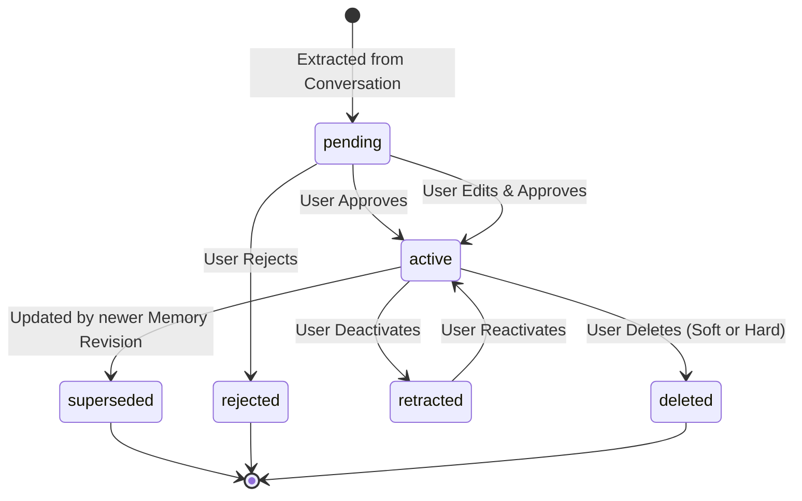

# Project Espera Architecture Specification

> **Version**: 1.0.0 (Phase 1 MVP)  
> **Status**: Approved for Implementation  
> **Target Runtime**: Cloudflare Workers + Cloudflare D1 + Cloudflare Pages (Vite/React)

---

## 1. Architectural Principles

Project Espera is a personal, continuous AI companion system designed around the following foundational rules:

1. **LLMs are Stateless, Replaceable Inference Engines**: Memory and persona never belong to OpenAI, Anthropic, or Google. They belong to Espera.
2. **Strict Domain Isolation**: Provider-specific request/response schemas (OpenAI ChatCompletion, Claude Messages API) must NEVER leak into the core domain.
3. **Context Continuity over Identical Replication**: Changing models will produce different phrasing because weights differ. Espera guarantees *continuity of user context, projects, facts, and preferences*, not verbatim token reproduction.
4. **Human-in-the-Loop Memory Lifecycle**: AI proposes memory candidates (`pending`); the user verifies and approves them into `active` memory via the Memory Inbox. Active memories are the only memories fed to general inference.
5. **D1 is the Single Source of Truth**: Relational data, revisions, and evidences live in D1. Vector databases (like Cloudflare Vectorize) are secondary search indices, not primary storage.
6. **Defense-in-Depth for Secrets**: BYOK API keys and memories are sensitive data. Keys are never logged, never returned in API GET responses, and in Phase 1 default to Session-only mode with zero persistence to DB.

---

## 2. Architecture Boundaries

```
+-------------------------------------------------------------------------+
|                               UI LAYER                                  |
|   React SPA + TanStack Query + React Router + Tailwind + Inspector UI   |
+-------------------------------------------------------------------------+
                                    |
                                    | REST / SSE (JSON)
                                    v
+-------------------------------------------------------------------------+
|                         APPLICATION LAYER (Hono)                        |
|   Auth / Session  |  Chat Route  |  Memory Route  |  Inspector Route   |
+-------------------------------------------------------------------------+
        |                                    |                    |
        v                                    v                    v
+----------------------+           +-------------------+  +---------------+
|    CONTEXT ENGINE    |           |   MEMORY ENGINE   |  |   SECURITY    |
| - Persona resolution |           | - Candidate extract|  | - Session-only|
| - Memory selection   |           | - Deduplication   |  | - AES-GCM     |
| - Token budgeting    |           | - Lifecycle & Rev |  | - Masking/San |
| - Context Run Log    |           | - Evidence Link   |  +---------------+
+----------------------+           +-------------------+
        |                                    |
        +------------------+-----------------+
                           |
                           v
+-------------------------------------------------------------------------+
|                           DOMAIN DATA LAYER                             |
|  Repositories: User | Persona | Project | Conversation | Memory | Run   |
|  Database: Cloudflare D1 (SQLite Engine)                                |
+-------------------------------------------------------------------------+
                           |
                           v
+-------------------------------------------------------------------------+
|                       PROVIDER ABSTRACTION LAYER                        |
|   Interface: LLMProvider (listModels, generate, stream, validate)      |
|   Adapters: MockProvider | OpenAIProvider | AnthropicProvider           |
+-------------------------------------------------------------------------+
```

---

## 3. Core Subsystems

### 3.1 Provider Abstraction Layer
Provider adapters implement the `LLMProvider` interface:
```typescript
export interface LLMProvider {
  id: string;
  name: string;
  listModels(): Promise<ModelDescriptor[]>;
  validateCredential(credential: ProviderCredential): Promise<boolean>;
  generate(request: ProviderGenerateRequest): Promise<ProviderResponse>;
  stream(request: ProviderGenerateRequest): AsyncIterable<ProviderStreamChunk>;
  getCapabilities(): ProviderCapabilities;
}
```
* **Internal Message Model**: Standardized `{ role: 'system' | 'user' | 'assistant', content: string }`.
* **MockProvider**: Provides deterministic responses for automated unit and integration tests without network I/O or paid keys.
* **OpenAI & Anthropic Adapters**: Translate internal messages to vendor wire protocols.

### 3.2 Context Engine
The Context Engine deterministically produces the context array for LLM requests:
1. **Persona Injection**: Selects active persona version rules (tone, instructions, principles).
2. **Project Context**: If `projectId` is present, loads project metadata and constraints.
3. **Memory Retrieval (Deterministic Phase 1)**:
   - Filters by `userId`, `status = 'active'`, and optional `projectId`.
   - Ranks by relevance (keyword query match + `importance` weight + `updatedAt` recency).
   - Enforces character/token budget (drops low-priority memories if limit reached).
4. **Recent History**: Loads the last $N$ turns (e.g., 10 messages) of conversation.
5. **Context Run Logging**: Saves a `ContextRun` snapshot into D1 recording exactly which memories were selected, the reasons for inclusion, and the assembled prompt.

### 3.3 Memory Engine & Human-in-the-Loop Lifecycle
Memory follows a strict state transition model:



* **Memory Candidate Extraction**:
  - Run asynchronously after chat response finishes (or triggered via worker).
  - Uses strict structured JSON output validation (Zod schema).
  - Rejects subjective mental state speculation or sensitive personal traits.
* **Deduplication & Conflict Detection**:
  - Compares candidate `(subject, predicate)` against existing active memories.
  - If identical, skips or updates confidence. If conflicting, flags as candidate replacement.
* **Auditability & Revisions**:
  - Every modification stores a `memory_revisions` record.
  - Every memory points to `memory_evidence` referencing the source message ID and text snippet.

---

## 4. Architecture Decision Records (ADR)

### ADR-001: Provider-Independent Domain Model
* **Status**: Accepted
* **Context**: Different LLM vendors evolve their APIs rapidly. Directly storing vendor payloads ties the database and UI to OpenAI or Anthropic.
* **Decision**: All entities (`Message`, `Memory`, `Conversation`, `Persona`) use vendor-agnostic schemas. Provider adapters map vendor responses to internal representations.
* **Consequence**: Zero vendor lock-in. Switching default models requires zero schema changes.

### ADR-002: Human-in-the-loop Memory Lifecycle
* **Status**: Accepted
* **Context**: Autonomous memory ingestion causes hallucinated facts, polluted context windows, and privacy leaks.
* **Decision**: All extracted memories enter `pending` status in a "Memory Inbox". Only memories explicitly approved by the user enter `active` status and become eligible for prompt injection.
* **Consequence**: Context remains high-signal and user-controlled.

### ADR-003: Deterministic D1 Selection over Early Vectorize Adoption
* **Status**: Accepted
* **Context**: Vector databases add embedding inference latency, vector index costs, and non-deterministic retrieval behavior that is hard to debug in early stages.
* **Decision**: In Phase 1, D1 SQL queries (filtering by user, project, active status, keyword matching, importance, recency) serve as the memory retrieval engine. Vectorize is deferred to Phase 2 as an auxiliary index.
* **Consequence**: Rapid local testing without Cloudflare Vectorize bindings; completely auditable context decisions.

### ADR-004: BYOK Credential Strategy
* **Status**: Accepted
* **Context**: Storing plaintext API keys on server databases creates critical security liabilities.
* **Decision**: Phase 1 defaults to **Session-only credentials** (supplied via request headers, held only in RAM during request). A secondary encrypted server storage option is specified using Web Crypto AES-GCM with Cloudflare Worker Secrets.
* **Consequence**: Keys are never stored unencrypted in D1 or logs.

### ADR-005: Cloudflare D1 as Single Source of Truth
* **Status**: Accepted
* **Context**: Memory requires referential integrity between messages, revisions, evidence, and personas.
* **Decision**: SQLite-based Cloudflare D1 is the authoritative datastore.
* **Consequence**: ACID transactions on edge, structured queries, straightforward backup and export.

---

## Phase 1.5 Provider Connection Architecture

`ProviderDefinition`(어댑터 종류)과 탭 단위 `ProviderConnection`(이름, Base URL, 모델 카탈로그, 비밀 키)을 구분한다. Chat은 connection ID로 UI 모델을 그룹화하지만 백엔드에는 실제 adapter provider ID와 model ID를 전달한다.

Provider Registry에는 Mock, OpenAI, Anthropic, Gemini, OpenAI-compatible adapter가 등록된다. `listModels(credential)`은 원격 카탈로그를 공통 `ModelDescriptor`로 정규화한다. Domain Layer에는 공급자 SDK 타입이 유입되지 않는다.

Session-only 키 데이터 흐름:

```text
Settings password input → React RAM → POST X-Espera-Credential
→ Hono route local variable → Provider adapter Authorization/x-api-key header
→ request completion 후 참조 해제
```

키는 Web Storage, D1, ContextRun에 기록하지 않는다. 비밀이 아닌 provider/model 선택값만 localStorage에 기록된다. OpenAI-compatible Base URL은 `/v1`을 한 번만 부착한다. 원격 redirect는 인증 헤더 유출 방지를 위해 거부한다.

현재 Node dev adapter는 인메모리 DB이고 Cloudflare 배포의 source of truth는 D1이다. 이 차이는 README의 제한사항에 명시한다.
