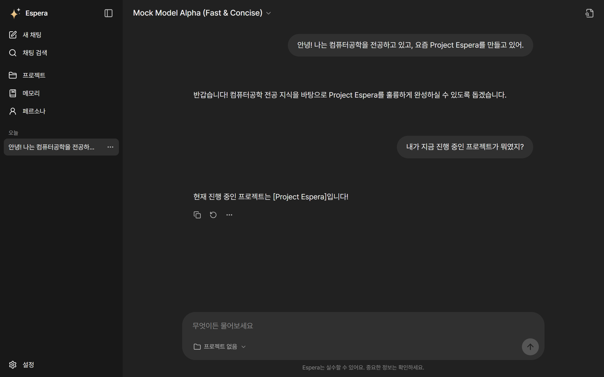
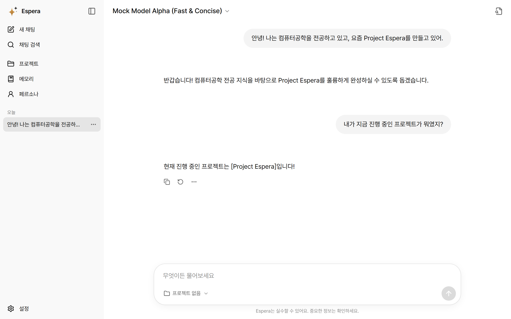
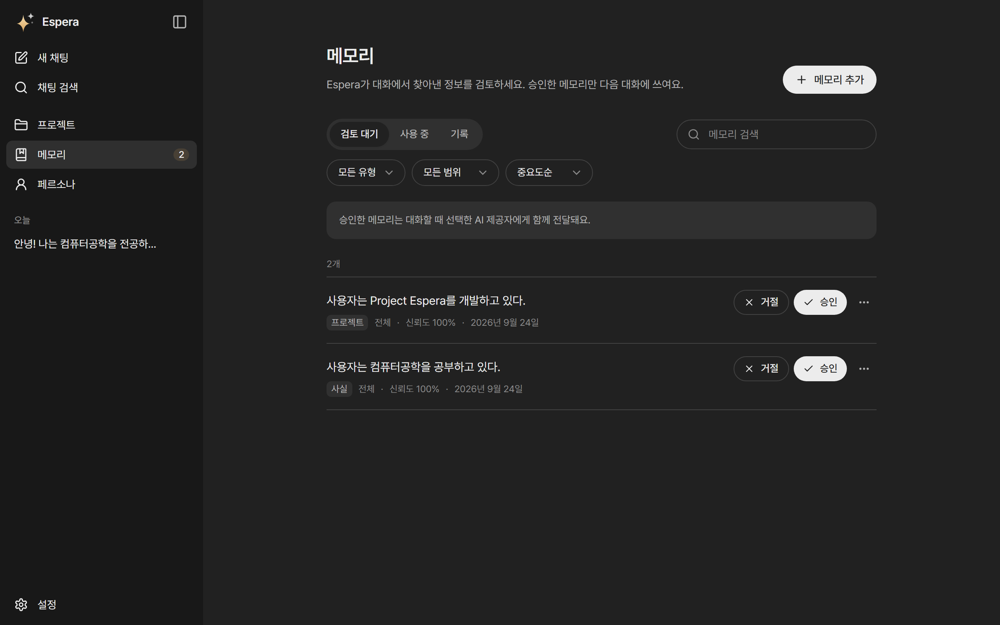
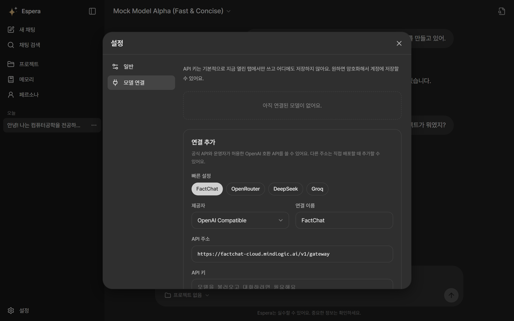
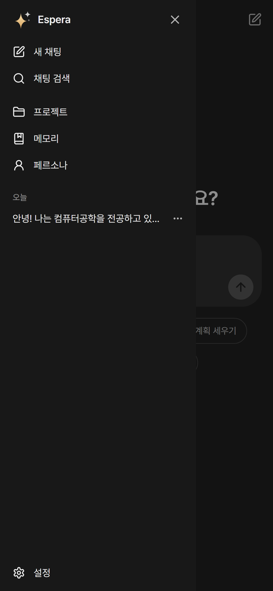
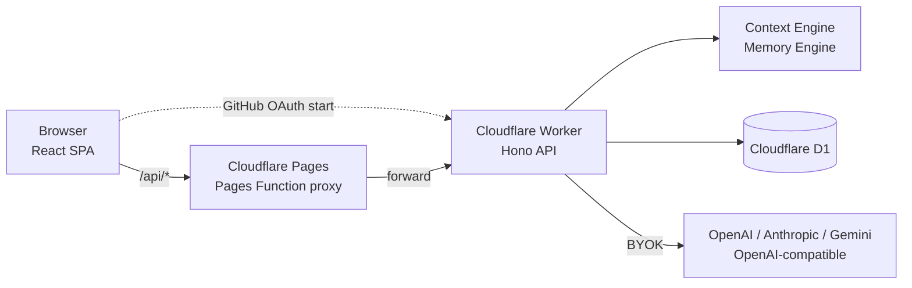

# Project Espera

**모델은 바꿔도, 맥락은 그대로.** 특정 AI 회사나 모델에 종속되지 않는 개인용 지속형 AI workspace입니다.

**1.0.0 Beta** · [Live demo](https://project-espera-web.pages.dev) · [배포 가이드](./DEPLOYMENT.md) · [변경 내역](./CHANGELOG.md) · MIT License

> Demo는 개인이 운영하는 베타 서비스입니다. 민감하거나 기밀인 정보를 입력하지 마세요. 저장 항목과 계정 데이터 삭제 방법은 [개인정보 안내](./PRIVACY.md)를 확인하세요.

사용자가 OpenAI, Claude, Gemini, OpenRouter, FactChat, LM Studio, vLLM 등 서로 다른 모델을 사용하더라도 Espera가 관리하는 다음 맥락은 계속 유지됩니다.

- 대화 기록
- Persona와 응답 선호
- 사용자가 승인한 장기 Memory
- 프로젝트별 작업 맥락
- Provider와 모델 연결 정보

## 스크린샷

| Chat (Dark) | Chat (Light) |
| --- | --- |
|  |  |
| **Memory** | **Settings** |
|  |  |

<p align="center"></p>

## 핵심 원칙

LLM은 교체 가능한 추론 엔진이고, 사용자 맥락은 Espera가 소유합니다. 모델을 바꾸면 답변의 문체와 추론은 달라질 수 있지만, 사용자가 승인한 Memory와 Persona는 유지됩니다.

Memory는 자동으로 즉시 확정되지 않습니다.

```text
대화 → Memory 후보 → 사용자 검토 → 승인 → 장기 Memory
```

## 주요 기능

- **ChatGPT 스타일 workspace**: 접을 수 있는 sidebar(새 채팅, 대화 검색, 날짜별 대화 그룹, 이름 변경·삭제), chat header의 model picker, composer의 project scope picker, 메시지 복사·재생성·삭제
- **Light/Dark/System 테마**, 한국어/English 전환, Pretendard 폰트, 키보드 단축키(`Ctrl+Shift+O` 새 채팅, `Ctrl+Shift+S` sidebar, `Ctrl+K` 또는 `/` 검색)
- **BYOK Provider**: Mock, OpenAI, Anthropic, Gemini, OpenAI-compatible. FactChat·OpenRouter·DeepSeek·Groq는 Settings의 빠른 설정 preset으로 바로 연결
- Provider별 모델 목록 조회와 수동 모델 ID
- API Key의 탭 메모리 보관 및 선택적 계정 암호화 저장(AES-GCM)
- **사용자 승인형 Memory**: Pending / Active / Rejected / Superseded / Deleted lifecycle, evidence와 revision history
- Persona 버전과 변경 이력, Project-scoped context, Context Inspector
- GitHub OAuth 기반 멀티유저 로그인과 사용자별 Conversation, Memory, Persona, Project 격리
- AI 응답의 신뢰할 수 없는 원격 이미지를 렌더링하지 않는 안전한 Markdown
- Cloudflare Workers + D1 + Pages 배포

## 기술 스택

- Frontend: React 19, TypeScript, Vite, Tailwind CSS
- API: Cloudflare Workers, Hono
- Database: Cloudflare D1(SQLite)
- Authentication: GitHub OAuth, HttpOnly Secure session cookie
- Test: Vitest, Playwright
- Deployment: Wrangler, Cloudflare Pages

## 아키텍처



브라우저는 Pages 출처의 `/api/*`만 호출하고 Pages Function이 Worker로 전달하므로 세션 쿠키가 first-party로 유지됩니다. Worker는 요청마다 Persona, 승인된 Memory, Project 맥락을 조립해 선택한 Provider에 전달합니다. 자세한 구조는 [ARCHITECTURE.md](./ARCHITECTURE.md)를 참고하세요.

## 로컬 실행

필요 조건: Node.js 20 이상, npm 10 이상

```bash
npm ci
npm run db:migrate:local
npm run dev
```

- Frontend: `http://localhost:5173`
- API: `http://127.0.0.1:8787`

Mock Provider는 외부 API Key 없이 사용할 수 있습니다.

## 테스트와 빌드

```bash
npm run typecheck
npm test
npm run lint
npm run build
npm run test:e2e
```

실제 Provider smoke test는 기본 실행하지 않습니다. 명시적으로 환경변수를 설정한 경우에만 실행해야 합니다.

## Provider와 API Key

Settings dialog의 Connections 탭에서 Provider, 연결 이름, Base URL, API Key를 입력합니다. OpenAI-compatible Provider는 빠른 설정 preset(FactChat, OpenRouter, DeepSeek, Groq)을 고르면 Base URL이 자동으로 채워집니다. FactChat의 Base URL은 `https://factchat-cloud.mindlogic.ai/v1/gateway`입니다. 기본 모드에서는 API Key를 D1, Web Storage, URL, 로그, Context Inspector에 저장하지 않으며 현재 브라우저 탭에서만 사용합니다.

암호화 저장을 선택하지 않은 경우 새로고침 후 API Key를 다시 입력해야 합니다. 계정에 저장한 Key는 로그인 후 복호화해 사용할 수 있습니다.

연결을 추가할 때 “계정에 API Key 기억하기”를 선택하면 API Key를 Worker 전용 Master Key로 AES-GCM 암호화하여 Provider connection과 함께 저장할 수 있습니다. 원본 Key는 API 응답이나 D1 조회 결과에 포함되지 않습니다. 이 기능을 사용하려면 Cloudflare Secret에 32바이트 Base64 키(`openssl rand -base64 32`)를 등록해야 합니다.

```bash
npx wrangler secret put ESPERA_MASTER_ENCRYPTION_KEY
```

저장된 Key는 로그인된 사용자의 Chat 요청에서만 복호화됩니다. Master Key를 분실하면 저장된 Provider Key를 복구할 수 없으므로 운영 전 별도 보관 정책이 필요합니다.

## 로그인 설정

GitHub OAuth App callback URL:

```text
https://project-espera-api.hfainvididual.workers.dev/api/auth/github/callback
```

OAuth 시작은 Worker에서 처리하고, callback은 짧게 만료되는 1회용 handoff를 프런트엔드로 전달합니다. 프런트엔드는 Pages Function을 통해 Worker와 같은 출처로 세션을 교환하므로 모바일 브라우저의 교차 사이트 쿠키 차단을 피합니다. API Worker 주소가 바뀌면 Pages 런타임 변수 `ESPERA_API_ORIGIN`을 설정하고, client를 빌드할 때 `VITE_AUTH_ORIGIN`에 Worker 출처를 지정하세요. `VITE_AUTH_ORIGIN`을 지정하지 않으면 production 빌드는 공개 Demo Worker로, 개발 빌드는 같은 출처로 로그인을 시작합니다.

Cloudflare secret:

```bash
cd packages/server
npx wrangler secret put GITHUB_CLIENT_ID
npx wrangler secret put GITHUB_CLIENT_SECRET
```

실제 secret은 소스코드나 문서에 기록하지 않습니다.

## 배포

직접 배포하려면 [DEPLOYMENT.md](./DEPLOYMENT.md)의 단계별 가이드를 따르세요. D1 생성과 migration, `wrangler.toml` 설정, GitHub OAuth App, Worker secret, Worker·Pages 배포, `VITE_AUTH_ORIGIN`·`ESPERA_API_ORIGIN` 설정까지 다룹니다.

기존 배포를 업데이트하는 요약:

```bash
cd packages/server
npx wrangler d1 migrations apply project-espera-db --remote
npx wrangler deploy
cd ../..
VITE_AUTH_ORIGIN=https://<worker> npm run build
npx wrangler pages deploy packages/client/dist --project-name <pages-project-name>
```

Pages 배포는 저장소 루트에서 실행해야 `functions/`의 API 프록시가 함께 배포됩니다. 운영 Worker는 공식 Provider endpoint와 운영자가 허용한 OpenAI 호환 API endpoint를 허용하며, 인증되지 않은 요청은 거부합니다. 호환 API 호스트 목록은 `packages/server/wrangler.toml`의 `ESPERA_ALLOWED_ENDPOINT_HOSTS`에서 관리합니다. 목록을 바꿀 때는 해당 호스트의 소유·DNS 통제와 전송되는 Key 및 대화 데이터의 처리 방식을 먼저 확인하세요.

공개 Demo 배포:

- Frontend: https://project-espera-web.pages.dev
- API: https://project-espera-api.hfainvididual.workers.dev
- Worker: `project-espera-api`
- D1: `project-espera-db`

## 문서

제품 의도, 도메인 모델, 인증, Context Engine, Memory Engine, 보안과 배포 구조는 [project.md](./project.md)를 참고하세요.

상세 아키텍처는 [ARCHITECTURE.md](./ARCHITECTURE.md), 배포 절차는 [DEPLOYMENT.md](./DEPLOYMENT.md), 변경 내역은 [CHANGELOG.md](./CHANGELOG.md), 보안 분석은 [THREAT_MODEL.md](./THREAT_MODEL.md)에 정리되어 있습니다.

Demo의 데이터 처리와 삭제 방법은 [PRIVACY.md](./PRIVACY.md), 취약점 제보 방법은 [SECURITY.md](./SECURITY.md)를 참고하세요.

## 라이선스

[MIT License](./LICENSE) © 2026 neruel

## 알려진 제한

- OAuth 로그인은 현재 GitHub provider만 지원합니다.
- 공개 Demo는 공식 API와 OpenAI 호환 API 중 운영자가 허용 목록에 둔 제공자를 지원합니다. 현재 OpenRouter, DeepSeek, Groq, Together, Fireworks, Mistral, xAI, Cerebras, SiliconFlow, Novita, Perplexity, Venice, Z.ai, MiniMax, FactChat을 지원하며, FactChat·OpenRouter·DeepSeek·Groq는 빠른 설정 preset을 제공합니다. API Key와 대화 내용은 선택한 제공자에게 전송됩니다. 다른 호스트는 운영자가 허용하거나 자체 배포 설정에서 추가해야 합니다.
- API Key는 기본적으로 새로고침 후 재입력이 필요하며, 사용자가 선택하면 암호화 저장할 수 있습니다.
- Memory 검색은 현재 D1 키워드 검색 중심입니다.
- 실제 Provider live test는 별도 API Key와 비용이 발생할 수 있으므로 opt-in입니다.

## 현재 UX

- Chat은 안전한 Markdown(신뢰할 수 없는 원격 이미지는 표시하지 않음), 코드·표·링크, 메시지 복사·삭제·재생성, 중단·재시도와 이전 메시지 pagination을 지원합니다.
- 긴 대화는 오래된 구간을 비신뢰 extractive summary로 압축하고 최근 메시지는 원문으로 유지합니다.
- Memory는 서버 검색·유형·프로젝트·정렬 필터, 승인 영향 안내, evidence와 revision 감사를 제공합니다.
- Provider connection은 수정·재검증할 수 있고 저장된 암호화 Key를 수정 중 안전하게 유지합니다.
- Model은 chat header의 model picker에서, Project scope는 composer의 picker에서 선택합니다.
- 모바일에서는 sidebar가 slide-in drawer로 열립니다.
- Settings는 General(테마, 언어, 단축키)과 Connections 탭으로 구성된 dialog입니다.
- Persona revision은 비교하고 이전 버전을 새 revision으로 복원할 수 있습니다.

Embedding 기반 semantic search, Vision, Tool calling은 Provider별 비용·권한·데이터 전송 정책이 필요한 선택적 확장 기능이며 현재 완성 범위에는 포함하지 않습니다.

## 운영 smoke test

`npm run test:production`은 Secret 없이 health, CORS, 인증 경계를 검증합니다. 인증된 데이터 흐름까지 검사하려면 임시 운영 세션을 `ESPERA_SESSION_COOKIE`로 전달합니다. 실제 Provider 모델 조회는 `ESPERA_LIVE_TESTS=1`일 때만 `npm run test:live`로 실행되며 최대 3회, 텍스트 생성 0회로 제한됩니다.
